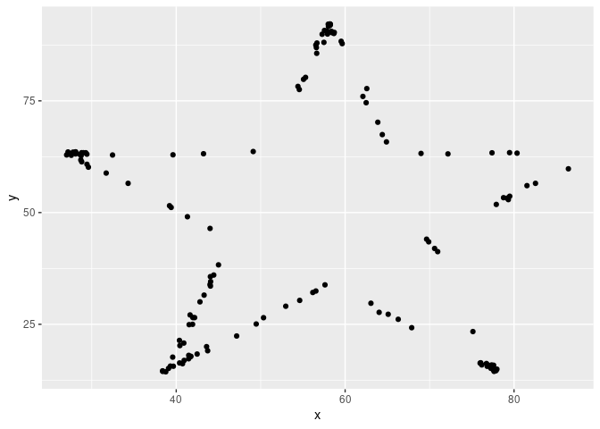
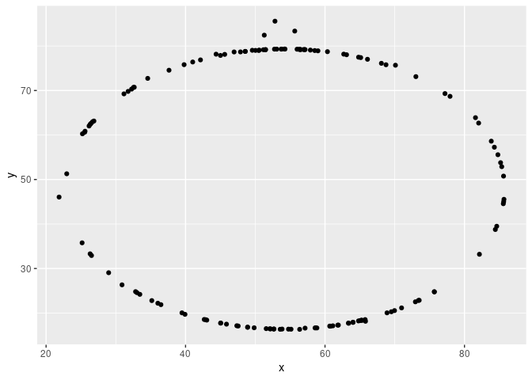
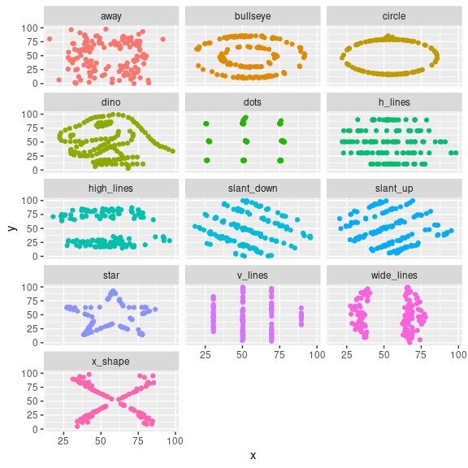

Lab 01 - Hello R
================
Thomas Monahan
9/6/21

## Load packages and data

``` r
library(tidyverse) 
library(datasauRus)
```

## Exercises

### Exercise 1

``` r
?datasaurus_dozen
```

Datasaurus\_dozen has 1846 rows and 3 columns.

### Exercise 2

``` r
datasaurus_dozen %>%
  count(dataset) %>%
  print(13)
```

    ## # A tibble:
    ## #   13 × 2
    ##    dataset   
    ##    <chr>     
    ##  1 away      
    ##  2 bullseye  
    ##  3 circle    
    ##  4 dino      
    ##  5 dots      
    ##  6 h_lines   
    ##  7 high_lines
    ##  8 slant_down
    ##  9 slant_up  
    ## 10 star      
    ## 11 v_lines   
    ## 12 wide_lines
    ## 13 x_shape   
    ## # … with 1
    ## #   more
    ## #   variable:
    ## #   n <int>

First let’s plot the data in the dino dataset:

``` r
dino_data <- datasaurus_dozen %>%
  filter(dataset == "dino")

ggplot(data = dino_data, mapping = aes(x = x, y = y)) +
  geom_point()
```

<!-- -->

And next calculate the correlation between `x` and `y` in this dataset:

``` r
dino_data %>%
  summarize(r = cor(x, y))
```

    ## # A tibble: 1 × 1
    ##         r
    ##     <dbl>
    ## 1 -0.0645

We find that the correlation between x and y is -.06447185. \#\#\#
Exercise 3

``` r
star_data <- datasaurus_dozen %>%
  filter(dataset == "star")
```

``` r
ggplot(data = star_data, mapping = aes(x = x, y = y)) +
  geom_point()
```

<!-- -->

``` r
star_data %>%
  summarize(r = cor(x, y))
```

    ## # A tibble: 1 × 1
    ##         r
    ##     <dbl>
    ## 1 -0.0630

We find that the correlation between x and y for the star data set is
-.0629611.

### Exercise 4

We will now explore the circle data set!

Note that two R chunks are given but they are not labeled. Use the
convention from above to name them appropriately.

``` r
circle_data <- datasaurus_dozen %>%
  filter(dataset == "circle")
```

``` r
ggplot(data = circle_data, mapping = aes(x = x, y = y)) +
  geom_point()
```

<!-- -->

``` r
circle_data %>%
  summarize(r = cor(x, y))
```

    ## # A tibble: 1 × 1
    ##         r
    ##     <dbl>
    ## 1 -0.0683

We find that the correlation between y and x for the circle data set is
-.06834336. When we compare this with the correlation for the dino data
we find:

``` r
circle_r = circle_data %>%
  summarize(r = cor(x, y)) 
dino_r = dino_data %>%
  summarize(r = cor(x, y)) 
(circle_r/dino_r)*100
```

    ##         r
    ## 1 106.005

We find that the r value for our circle data set is 6% greater than that
of the dino data set. \#\#\# Exercise 5

Plotting all datasets at once!

``` r
ggplot(datasaurus_dozen, aes(x = x, y = y, color = dataset))+
  geom_point()+
  facet_wrap(~ dataset, ncol = 3) +
  theme(legend.position = "none")
```

<!-- -->

Generating the summary coefficients:

``` r
datasaurus_dozen %>%
  group_by(dataset) %>%
  summarize(r = cor(x, y)) %>%
  print(13)
```

    ## # A tibble:
    ## #   13 × 2
    ##    dataset   
    ##    <chr>     
    ##  1 away      
    ##  2 bullseye  
    ##  3 circle    
    ##  4 dino      
    ##  5 dots      
    ##  6 h_lines   
    ##  7 high_lines
    ##  8 slant_down
    ##  9 slant_up  
    ## 10 star      
    ## 11 v_lines   
    ## 12 wide_lines
    ## 13 x_shape   
    ## # … with 1
    ## #   more
    ## #   variable:
    ## #   r <dbl>
